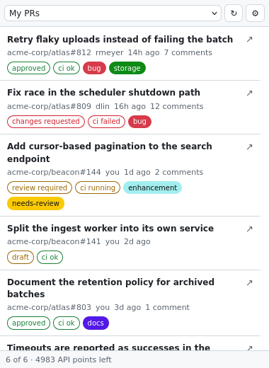
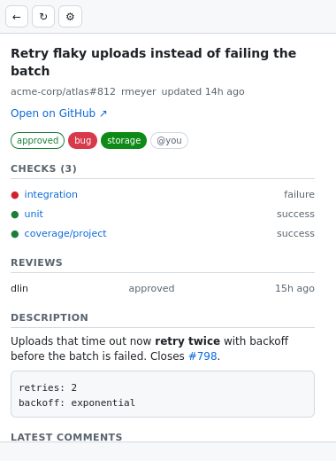

# gh-viewer

A Firefox sidebar — and a Chrome side panel — for managing GitHub views
independently from your tab workflow. Keep track of PRs, quickly view your
sprint backlog, and check for mentions all without switching tabs.

<div align="center">
  <table>
    <tr>
      <td align="center" valign="top">
        <picture>
          <source media="(prefers-color-scheme: dark)" srcset="screenshots/01-list-dark.png">
          
        </picture>
        <br><sub>Your views, in the sidebar</sub>
      </td>
      <td align="center" valign="top">
        <picture>
          <source media="(prefers-color-scheme: dark)" srcset="screenshots/02-detail-dark.png">
          
        </picture>
        <br><sub>A pull request, drilled into</sub>
      </td>
    </tr>
  </table>
</div>

## Install

**1. Add it to your browser.**

*Firefox* — download the latest `.xpi` from the
[releases page](https://github.com/nikopoulospet/gh-viewer/releases/latest),
then in Firefox open `about:addons`, click the gear icon, and choose
**Install Add-on From File…** — or simply drag the downloaded file onto a
Firefox window.

*Chrome* — download `gh-viewer-chrome-<version>.zip` from the
[releases page](https://github.com/nikopoulospet/gh-viewer/releases/latest) and
unzip it. Open `chrome://extensions`, turn on **Developer mode** (top right),
click **Load unpacked** and pick the unzipped folder. Needs Chrome 114 or newer,
which is where the side panel arrived.

> Chrome only installs extensions from its Web Store, and gh-viewer isn't listed
> there, so this route needs Developer mode and won't auto-update. To move to a
> new version, unzip it and press ↻ on the extension's card in
> `chrome://extensions`.

**2. Give it access to your GitHub.** Open
[the gh-viewer App page](https://github.com/apps/gh-viewer-sidebar/installations/new),
press *Install*, and choose which account or organisation it may read — and within
that, all repositories or a hand-picked few. You can change or revoke this at
any time in GitHub's *Settings → Applications*.

> Installing on an organisation you don't own sends a request to an owner
> instead. They approve it once, and it covers everyone in the org.

**3. Sign in.** Open the panel — in Firefox, View → Sidebar → gh-viewer; in
Chrome, the toolbar button — and press **Connect**. The browser asks whether
gh-viewer may access `github.com` — it needs that only to exchange the sign-in
code, and the answer is remembered. GitHub then shows you a short code, you
approve it in the tab that opens, and that's it — you won't be asked again.

## Using it

The dropdown at the top switches between your saved views. **↻** refreshes.
**⚙** opens the editor where you add and change views.

- **Click a row** to drill into it — checks with their pass/fail state, who has
  reviewed, and the most recent comments.
- **Click the ↗ on a row**, or any link anywhere. If you already have a tab
  open on that page it switches to that tab; otherwise it opens a new one.
  Middle-click or Ctrl-click always opens a new tab in the background instead.
- **←** takes you back to the list.

The bar along the bottom tells you how many results came back and how much of
your GitHub API budget is left. You have 5,000 points an hour and each refresh
costs one, so it's not something you'll run into.

## Making your own views

gh-viewer ships with **one** view — *My PRs* — which uses `involves:@me`,
meaning anything you authored, were assigned, commented on, or were mentioned in.
That single qualifier is doing real work: GitHub's GraphQL search has no `OR`
operator, so `(assignee:@me OR author:@me)` matches nothing at all. `involves:@me`
is the closest single-search expression of "mine", at the cost of also showing
PRs you merely commented on.

Everything else is yours to build in **⚙**. Some ready-made views to copy — use
*Add query*, then paste the `q` value and adjust:

| View | `q` |
| --- | --- |
| Awaiting my review | `is:pr state:open review-requested:@me archived:false` |
| My open issues | `is:issue state:open assignee:@me archived:false` |
| Assigned to me only | `is:pr state:open assignee:@me archived:false` |
| Opened by me only | `is:pr state:open author:@me archived:false` |
| My failing PRs | `is:pr state:open involves:@me status:failure` |
| Needs my attention | `is:pr state:open involves:@me review:none` |

A discussions view needs a different document, since discussions are a separate
search type; `GV.DISCUSSION_DOC` in `lib/store.js` is a ready-made one to paste
into the document field, with `search.nodes` / `search.discussionCount` as the
paths.

The part you'll change most is the **search string**, which is exactly what you
would type into GitHub's own search box:

| To see | Search |
| --- | --- |
| Your open PRs in one repo | `repo:some-org/some-repo is:pr state:open assignee:@me` |
| Everything awaiting your review | `is:pr state:open review-requested:@me` |
| Your team's review queue | `is:pr state:open team-review-requested:some-org/some-team` |
| Bugs filed across an org | `org:some-org is:issue state:open label:bug` |
| PRs you opened that aren't drafts | `is:pr state:open author:@me draft:false` |
| Stale PRs | `is:pr state:open assignee:@me updated:<2026-08-01` |

`@me` always means you, so a view keeps working if someone else uses it.

Each view also has a **GraphQL document** — the actual query sent to GitHub.
The default one fetches the fields the list needs, and most of the time you can
leave it alone. If you do write your own, two things matter: keep `id` in the
fields you select (that's what drilling down uses), and point **list path** at
the array you want rendered, e.g. `search.nodes`.

## What it can see

When you install the App, GitHub asks it to read these, and nothing else:

- **Issues, pull requests and discussions** — the things it lists.
- **Checks and commit statuses** — so a PR can show whether CI passed.
- **Projects** — so views can include project board fields.
- **Metadata** — repository names. Every GitHub App requires this.

It cannot write anything: it can't comment, merge, close, or change a label.
There is no `contents` permission, so it cannot read your source code.

Your keys are stored locally and shared only with GitHub.

## Reporting a problem

The **⚙ → Diagnostics** tab builds a snapshot of how gh-viewer is configured and
what it can reach, ready to paste into a bug report. Tick *also run each saved
query* and it will additionally run your queries and record which ones failed
and why — usually the fastest way to identify a missing permission.

**Your access token is never included**, only whether one exists and what kind
it is. Do read the report before sharing it, though: your saved queries can name
private repositories and organisations, and those do travel with it.

## Running it from source

*Firefox* — open `about:debugging#/runtime/this-firefox`, choose *Load Temporary
Add-on*, and pick `extension/manifest.json` from a clone of this repo. Firefox
discards temporary add-ons on restart.

*Chrome* — Chrome needs a manifest of its own, so build one first:

```bash
python3 tools/build_chrome.py           # writes dist/chrome/
python3 tools/build_chrome.py --zip     # and the distributable zip
```

Then open `chrome://extensions`, turn on **Developer mode**, click **Load
unpacked** and pick `dist/chrome`. Re-run the build and press ↻ on the card
after changing anything.

Either way this is for development rather than daily use — see
[DEVELOPING.md](DEVELOPING.md).

## If something looks off

**The list is empty but GitHub's website isn't.** The App probably isn't
installed on the organisation that owns those repos, or is installed but only
on a few repositories. Check *Settings → Applications → gh-viewer*.

**The status bar says "partial".** A field couldn't be read — usually a
permission the App wasn't granted. The rest of the results are still accurate.

**It asks you to connect again.** Your access was revoked on GitHub's side, or
the App was configured to expire tokens. Pressing Connect again fixes it.

**Nothing appears after you press Connect.** The App needs Device Flow enabled;
whoever registered it can turn that on in its settings.

**Connect says it needs permission to reach github.com.** The browser asks
before letting gh-viewer talk to `github.com`, and the answer wasn't Allow.
Press Connect again and allow it, or grant it from the extensions button in the
toolbar. Nothing else in gh-viewer uses that access — listing your issues and
PRs goes to `api.github.com`, which needs no permission at all.
